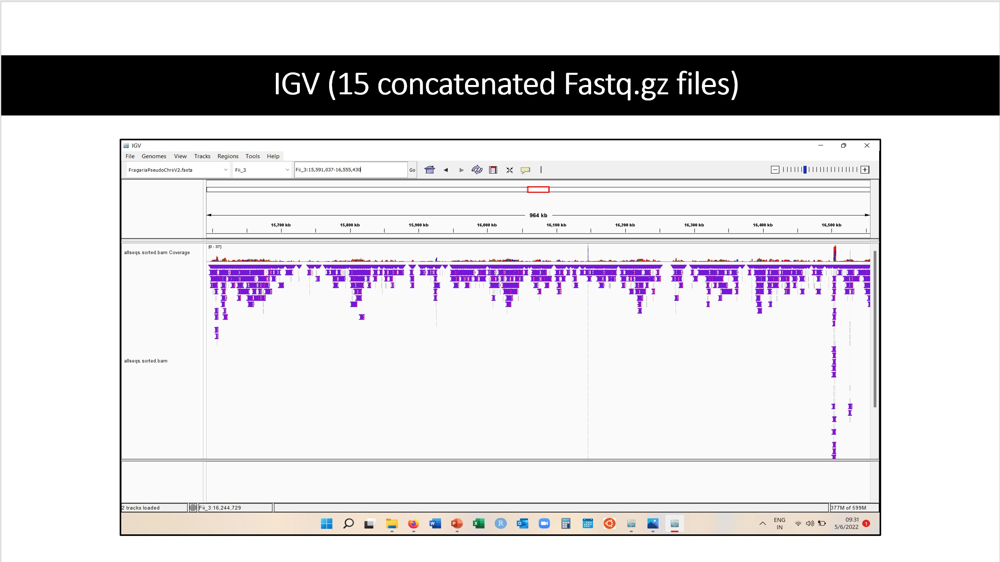

# Aligning two Fragaria iinumae Genomes 
### by Anushreeya Gurung and Mamta Kajal

## Introduction
Fragaria iinumae (2n) is one of the diploid progenitors to cultivated strawberry, Fragaria ×ananassa (8x) (Rousseau-Gueutin et al. 2009; Dimeglio et al., 2014). Davis Lab at UNH sequenced the genome of F. iinumae in 2017 using Illumina Sequencing platform. This assembly is in its pseudochromosomes form. However, there are still some gaps or missing reads in the assembly. Recently, genome from the same plant was sequenced using Oxford Nanopore Sequencing Technology in Davis Lab. This data is in its raw from (220 Fastq files). The purpose of this assembly will be filling in the gaps between the earlier genome and checking how accurate it is.

## Project
For Gen 711/811, we are doing a part of this project i.e., aligning the raw reads of Nanopore genome data to pseudochromosomes of Illumina Seequenced Genome. We are interested in checking how accurate the pseudochromosome assembly is and how will the reads from Nanopore data align to it. 
					
## Material
#Reference Genome: Pseudochomosomes assembly of F. iinumae (~198 Mb)
#Query Genome: Raw reads generated from Oxford Nanopore Sequencing (220 Fastq files)
Both the genomes are sequenced from one plant of F. iinumae. As these genomes are not published, we have not uploaded the files in here.

## Method

The Project Workflow/Pipeline:


The major softwares used were BWA, SAMtools and IGV. The exact commands used in this study are in a shell script file in the directory. Following are breif details about these tools:

### BWA
Software for aligning sequence against a genome. There are 3 different algorithms we can specify from that will make the analysis more accurate that is determined from the size of the reads. We used mem algorithm at first because it Align 70bp-1Mbp query sequences and ours are 100-200 bp long. This did not generate correct SAM/BAM files so we were advised to use bwasw as this is better for long reads. The inputs are reference genome sequence and raw reads in the form of fastq and it outputs a SAM file. A SAM file is a human readable text file that contains the results of the analysis that compared the raw reads to the reference sequence. 
```
BWA can be cloned by: git clone https://github.com/lh3/bwa.git
cd bwa;
make;
./bwa index reference.fastq
./bwa algorithm reference.fastq rawread.fastq > align.sam
```

### SAMtools
A software for parsing and manipulating the alignments in SAM/BAM file. The input was a SAM file and a BAM file was generated, then the BAM file which is the binary computer legible version of the SAM file was used to generate a stats file. The stats file was then used to generate plots on coverage and depth statistics which are helpful in knowing about the similarities in both the genomes.  
```
Samtools –b align.sam > align.bam
samtools stats input.bam > input.bam.stats
plot-bamstats -p sample# input.bam.stats
```

### IGV
Integrated Genome Viewer (IGV) is an interactive tool for the visual exploration of genomic data. We aligned both the genome sequnces against each other in IGV to see alignment. For viewing, index files of both the genomes are also required. 

## Results
We started by concatenating 15 fastq files (out of 220 concatenated files) into one file and then aligning this file to reference genome. 
### 15 concatenated reads

We first concatanated the alignment results of 15 random reeds to make sure the pipeline we provided above would work. 
##### Percentile of mapped sequence ordered by GC content vs mapped depth
Mapped depth increases with percent of mapped sequence and there is a higher median depth for higher GC content. This means the sequences that were higher in GC content could be better sequenced.  
##### Coverage vs Number of mapped bases
This plot is empty even though we expect line of the coverage to peak at 0 and tapper off to 1 to represent that there are less areas with high depth. We are not sure why this plot is not showing depth, but when this file was aligned with reference genome in IGV, much read depth was seen. 
##### GC Content [%] vs Normalized frequency
The long reads have a model GC content of 38.4% which apporoximately same as mentioned by Qiao et al (2021) i.e., 39.70% GC content.
##### Read cycle vs indel count
The number of insertions and deletions is high for the first 20000 cycles but then sharply decreases and stays steady. 
##### Read cycle vs Base content [%] 
These reads are high in Thymine(blue) and Adenine(green) as shown by the blue and the faint green line that is underneath the blue. 
##### Indel length vs Indel count [log]
The insertions and deletion patterns of the indels are fairly the same and there are smaller indels than larger. The model of the ins/del ratio is between 50 and 60 which means insertions occur more frequently than deletions in these read samples and the inserted reads are longer than the size of the deleated reads.

### 220 concatenated reads


After we were sure the pipleline was not erroneous, we proceded the analysis by concatenating all the 220 fastq files into one file and then aligning this file with reference genome.
##### Indel length vs Indel count [log]
The insertions and deletion patterns of the indels are fairly the same and there are smaller indels than larger. The model of the ins/del ratio is around 80 which means insertions occur more frequently than deletions and the inserted reads are longer than the size of the deleated reads in these read samples which is consistant with the results of 15 concatnated reads. 
##### Read cycle vs indel counthigh
The numebr of insertions and deletions is high for the first 20000 cycles but then sharply decreases and stays steady which is consistant with the results of 15 concatnated reads. 
##### Read cycle vs Base content [%] 
These reads are high in Thymine(blue) and Adenine(green) as shown by the blue and the faint green line that is underneath the blue which is consistant with the results of 15 concatnated reads. It also makesn sense for the purine and pyrimidine to both be high and they are complements. 
##### Coverage vs Number of mapped bases
This plot is empty even though we expect line of the coverage to peak at 0 and tapper off to 1 to represent that there are less areas with high depth. We are not sure why this plot is not showing depth. 
##### GC Content [%] vs Normalized frequency
The long reads have a model GC content of 38.4% which is consisitant with the results achieved for the 15 concatnated reads. 

### IGV Analysis
Here we wanted to test the pipleline for errors so we randomly selected 15 reads to analyze the depth.
Here we could see similarities between the reads and could tell that with the addition of more reads that there would be regions of high and low depth.



This is a concatenation of 15 of the reads and already we can tell there is a pattern of regions with higher depth. Sometimes there is a contig in one read where there is a gap in another read. These are split reads and can be used to improve the reference genome assembly. Not pictured here but there are regions of repeated sequences so reads will pile up at the first instance of the repeated sequence. This means there will be higher depth at a repeated sequence location at the begining of the refernece genome rather than later instances of the same sequence because alignment is order based. 


This image was generated by aligning the the all the 220 concatenated files with reference genome. Here can be seen that more depth is reported as compare to 15 concatenated files.

## Conclusions and Future Work
Initially, we were not able to figure out that why the Nanopore sequencing generated 220 fastq files. But later the difference in read length of concatenated files (15 fastq files and 220 fastq files) viewed in IGV, helped us conclude that because the sequencing continued for around 3 days, the same sample might have run many a times and each cycle generated individual files. Also, we found that the GC content in the genome is almost simillar to what predicted by Qiao et al (2021). It can be said that the genome contains predicted amount of coding regions. We were also able to see split reads in the query genome and reference genome (picture not shown here), which is a positive indication that by eliminating errors in the Nanopore genome assembly, and aligning it to reference genome, we can fill in the gaps of reference genome.

## Commands used:
These are the general commands we used for the analysis: 
Reference genome : FragariaPseudoChrsV2.fasta
Query genome files: FAQ99085_pass_635cf375_2.fastq

```
 bwa index reference.fastq
 bwa bwasw FragariaPseudoChrsV2.fasta FAQ99085_pass_635cf375_2.fastq > sample.sam
 samtools view -S -b sample.sam > sample.bam
 samtools stats sample4.bam > sample4.bam.stats
 samtools view sample4.bam | head
 samtools sort sample4.bam -o sample4.sorted.bam
 samtools view sample4.sorted.bam | head
 samtools index sample4.sorted.bam
 plot-bamstats -p my_output sample4.bam.stats 
```
 
 ## Acknowledgements
 #### Dr Jefferey Miller
 #### Dr Tom Davis
 #### Clayton Ludwig (PhD Candidate)
 
## References
#### DiMeglio, L. M., Staudt, G., Yu, H., & Davis, T. M. (2014). A Phylogenetic Analysis of the Genus Fragaria (Strawberry) Using Intron-Containing Sequence from the ADH-1 Gene. PLoS ONE, 9(7), e102237. https://doi.org/10.1371/journal.pone.0102237
#### Rousseau-Gueutin, M., A. Gaston, A. Aïnouche, M.L. Aïnouche, K. Olbricht, G. Staudt, L. Richard, and B. Denoyes-Rothan. 2009. Tracking the evolutionary history of polyploidy in Fragaria L. (strawberry): New insights from phylogenetic analyses of low-copy nuclear genes. Mol. Phylogenet. Evol. 51:515–530. doi:10.1016/j.ympev.2008.12.024
#### Qiao Qin, Edger Patrick P., Xue Li, Qiong La, Lu Jie, Zhang Yichen, Cao Qiang, Yocca Alan E., Platts Adrian E., Knapp Steven J., Van Montagu Marc, Van de Peer Yves, Lei Jiajun, & Zhang Ticao. (2021). Evolutionary history and pan-genome dynamics of strawberry (Fragaria spp.). Proceedings of the National Academy of Sciences, 118(45), e2105431118. https://doi.org/10.1073/pnas.2105431118
